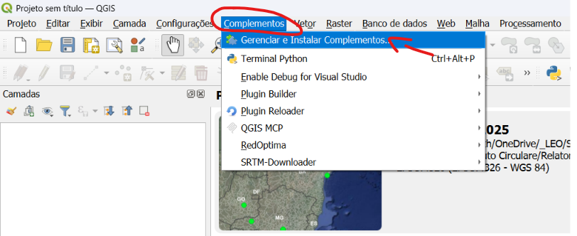

# Guia passo a passo — publicar o Portal do Curso RedBasica

Este guia é para ser seguido do começo ao fim, na ordem, sem
conhecimento técnico. Cada parte diz **onde clicar** e **o que digitar**.

Reserve cerca de 1 hora para a primeira publicação. Depois disso,
qualquer alteração leva 2 minutos.

---

## Visão geral: o que você vai fazer

| Parte | O que é | Tempo |
| --- | --- | --- |
| 1 | Criar o repositório no GitHub | 5 min |
| 2 | Enviar os arquivos do site | 10 min |
| 3 | Ligar o GitHub Pages (colocar no ar) | 5 min |
| 4 | Publicar o ZIP do plugin como *Release* | 10 min |
| 5 | Colocar os materiais do curso | 10 min |
| 6 | Criar os dois formulários no Tally | 20 min |
| 7 | Preencher o `js/main.js` com os links | 5 min |
| 8 | Gerar o QR Code | 2 min |
| 9 | O que fazer durante o curso | — |
| 10 | Conferência final de segurança | 3 min |

**Decisões já tomadas neste guia** (mude se preferir):

- Conta do GitHub: **leonazareth** (`leonazareth@gmail.com`)
- Nome do repositório: **`curso-redbasica`**
- Endereço final da página: **`https://leonazareth.github.io/curso-redbasica/`**

Se você usar outro nome de repositório, troque `curso-redbasica` por
esse nome em todos os endereços deste guia.

---

## ⚠️ Antes de começar: o repositório é público

Tudo que você enviar para lá pode ser visto por qualquer pessoa da
internet, para sempre — mesmo que você apague depois.

Nesta pasta existe o arquivo **`Proposta Curso SaniHUB
RedBasica_revLN.docx`**, que tem valores comerciais e não pode ser
publicado.

Já criei uma proteção (o arquivo `.gitignore` bloqueia qualquer `.docx`),
mas o mais seguro é **mover essa proposta para uma pasta de fora**,
por exemplo uma pasta acima:

```
_Proposta Curso\
├── Proposta Curso SaniHUB RedBasica_revLN.docx   ← mova para cá
└── portal-cursos-redbasica\                       ← esta vira o repositório
```

Faça isso agora, antes de continuar. Leva 5 segundos e elimina o risco.

---

# PARTE 1 — Criar o repositório no GitHub

Um "repositório" é só uma pasta hospedada no GitHub.

### 1.1 Entrar na conta certa

Você tem duas contas GitHub. Precisamos da **leonazareth**.

1. Abra <https://github.com> no navegador.
2. Clique na sua foto, no canto superior direito.
3. Confira o nome de usuário que aparece. Precisa ser **leonazareth**.
   - Se aparecer `leo-nazareth`, clique em **Sign out** e entre de novo
     com o e-mail `leonazareth@gmail.com`.

### 1.2 Criar o repositório

1. Vá para <https://github.com/new>.
2. Preencha:

   | Campo | O que colocar |
   | --- | --- |
   | **Repository name** | `curso-redbasica` |
   | **Description** | `Portal do participante do curso SaniHUB RedBasica` |
   | **Public / Private** | marque **Public** |
   | **Add a README file** | deixe **desmarcado** |
   | **.gitignore / license** | deixe em **None** |

   > **Por que Public?** O GitHub Pages só é gratuito em repositórios
   > públicos. Em repositório privado, a página não vai ao ar.

3. Clique no botão verde **Create repository**.

Pronto. Você vai cair numa página quase vazia com instruções — pode
ignorá-las, o próximo passo explica tudo.

---

# PARTE 2 — Enviar os arquivos do site

Existem dois caminhos. **Escolha um.**

- **Caminho A — pelo navegador** (arrastar e soltar). Mais simples, sem
  instalar nada. Recomendado se você não usa Git.
- **Caminho B — pelo terminal** (comandos). Mais rápido nas próximas
  vezes.

---

## Caminho A — pelo navegador (recomendado)

### 2A.1 Preparar

Abra a pasta `portal-cursos-redbasica` no Explorador de Arquivos do
Windows.

Confira que ela tem estes itens:

```
index.html
README.md
GUIA-PASSO-A-PASSO.md
css\
js\
images\
gifs\
docs\
fonts\
```

**Não** deve ter o arquivo `.docx` (se ainda tiver, mova para fora agora).

> Os arquivos `.gitignore`, `.nojekyll` e a pasta `.backup` começam com
> ponto e ficam escondidos no Windows. Vamos tratar deles no passo 2A.4.

### 2A.2 Enviar

1. No GitHub, dentro do repositório recém-criado, clique em
   **Add file** (botão perto do topo) → **Upload files**.
2. Abra a pasta no Windows, **selecione tudo** (`Ctrl + A`) e **arraste**
   para a área tracejada da página do GitHub.
   - Se aparecer o `.docx` na lista, clique no **X** ao lado dele para
     removê-lo antes de continuar.
3. Espere as barrinhas de progresso terminarem (pode levar 1–2 minutos).
4. Role até o fim da página. No campo de mensagem, escreva:
   `Primeira versão do portal do curso`
5. Clique no botão verde **Commit changes**.

### 2A.3 Conferir

A página do repositório deve mostrar as pastas `css`, `docs`, `fonts`,
`gifs`, `images`, `js` e os arquivos `index.html`, `README.md`,
`GUIA-PASSO-A-PASSO.md`.

### 2A.4 Criar o arquivo `.nojekyll` (importante)

O Windows não deixa arrastar arquivos que começam com ponto. Vamos criar
esse pelo próprio GitHub:

1. **Add file** → **Create new file**.
2. No campo do nome do arquivo, digite exatamente: `.nojekyll`
3. Deixe o conteúdo **vazio**.
4. Role até embaixo e clique em **Commit changes** → **Commit changes**.

> **Para que serve?** Sem ele, o GitHub tenta "processar" o site e pode
> ignorar pastas cujo nome comece com underline. Com ele, os arquivos são
> servidos exatamente como estão.

Repita o mesmo procedimento para criar o arquivo `.gitignore`, colando
dentro dele o conteúdo do arquivo `.gitignore` que está na sua pasta
(abra com o Bloco de Notas para copiar). Esse passo é opcional, mas
protege você de subir a proposta por engano no futuro.

---

## Caminho B — pelo terminal

Você já tem o Git instalado e as duas contas configuradas. **A chave
padrão já é a da conta `leonazareth`**, então não precisa de nenhuma
configuração extra.

### 2B.1 Conferir a conta (opcional, 10 segundos)

Abra o **Git Bash** (menu Iniciar → digite "Git Bash") e cole:

```bash
ssh -T git@github.com
```

Deve responder:

```
Hi leonazareth! You've successfully authenticated...
```

Se responder `Hi leo-nazareth!`, pare e me chame — a chave padrão está
trocada.

### 2B.2 Enviar os arquivos

No Git Bash, cole os comandos abaixo **um de cada vez**:

```bash
cd "/d/OneDrive/_LEO/Servicos Ativos/SaniHUB/_Proposta Curso/portal-cursos-redbasica"

git init -b main
git add .
git commit -m "Primeira versão do portal do curso"
git remote add origin git@github.com:leonazareth/curso-redbasica.git
git push -u origin main
```

Se o `git push` reclamar de "repository not found", confira se o nome do
repositório está igual ao que você criou na Parte 1.

### 2B.3 Nas próximas vezes

Depois de editar qualquer arquivo, basta:

```bash
git add .
git commit -m "descreva o que mudou"
git push
```

---

# PARTE 3 — Ligar o GitHub Pages (colocar a página no ar)

1. No repositório, clique em **Settings** (engrenagem, na barra de abas
   do topo — não confundir com as configurações da sua conta).
2. Na coluna da esquerda, clique em **Pages**.
3. Em **Build and deployment**:

   | Campo | Escolha |
   | --- | --- |
   | **Source** | `Deploy from a branch` |
   | **Branch** | `main` |
   | **Folder** | **`/ (root)`** |

   > ⚠️ **Não escolha `/docs`.** A pasta `docs/` deste projeto guarda os
   > materiais do curso, não o site. Se escolher `/docs`, a página não
   > abre.

4. Clique em **Save**.
5. Espere de 1 a 3 minutos. Recarregue a página do Settings → Pages: vai
   aparecer uma faixa verde com o endereço:

   ```
   https://leonazareth.github.io/curso-redbasica/
   ```

6. Abra esse endereço. **A página está no ar.**

> Nesse momento vários botões vão aparecer em cinza, com a marca
> *em breve*. Isso é o esperado — eles ficam assim até você preencher os
> links na Parte 7.

### Sempre que você mudar algo

Depois de enviar uma alteração, o GitHub leva de 30 segundos a 2 minutos
para atualizar a página. Se não mudar nada, atualize o navegador com
`Ctrl + F5` (força a recarga ignorando o cache).

---

# PARTE 4 — Publicar o ZIP do plugin como *Release*

A *Release* é a área do GitHub feita para distribuir arquivos para
download. É melhor do que jogar o ZIP na pasta do repositório porque não
pesa no repositório e gera um link estável e limpo.

### 4.1 Preparar o ZIP do plugin

O arquivo precisa ser o ZIP que o QGIS instala em
`Plugins → Manage and Install Plugins → Install from ZIP`.

Sugestão de nome: `RedBasica-1.9-beta.zip`
(sem espaço, sem acento).

### 4.2 Criar a Release

1. Na página principal do repositório, olhe a coluna da direita e clique
   em **Releases** → **Create a new release**.
   (Se ainda não existir nada, o link é **Create a new release**.)
2. Preencha:

   | Campo | O que colocar |
   | --- | --- |
   | **Choose a tag** | clique, digite `v1.9-beta` e escolha **`+ Create new tag: v1.9-beta on publish`** |
   | **Release title** | `RedBasica 1.9 beta — curso` |
   | **Describe this release** | `Versão distribuída no curso. Compatível com QGIS 3.44.` |

3. Mais abaixo, existe a área **"Attach binaries by dropping them here or
   selecting them"**. **Arraste o arquivo ZIP** para lá e espere o upload
   terminar (aparece o nome do arquivo com o tamanho).
4. Deixe marcado **Set as the latest release**.
5. Clique no botão verde **Publish release**.

### 4.3 Copiar o link do ZIP

Ainda na página da release:

1. Encontre o nome do arquivo `RedBasica-1.9-beta.zip` (na seção
   **Assets**).
2. **Clique com o botão direito** em cima do nome → **Copiar endereço do
   link**.

O link copiado tem esta cara:

```
https://github.com/leonazareth/curso-redbasica/releases/download/v1.9-beta/RedBasica-1.9-beta.zip
```

**Guarde esse link.** Ele vai na Parte 7, no campo `download`.

### 4.4 Quando sair uma versão nova

Repita o processo com uma tag nova (`v1.10`, por exemplo) e depois
atualize dois campos no `js/main.js`: `download` e `versao.plugin`.

---

# PARTE 5 — Colocar os materiais do curso

Você tem duas opções para cada arquivo. Decida pelo **tamanho**:

| Tamanho | Onde colocar | Por quê |
| --- | --- | --- |
| até ~20 MB | pasta `docs/` do repositório | simples, link direto |
| acima de ~20 MB | como **Release** (igual à Parte 4) | não pesa no repositório |

> O GitHub **recusa** arquivos acima de 100 MB. ZIP de projeto QGIS com
> raster costuma passar disso — nesse caso use Release.

### 5.1 Arquivos pequenos (pasta `docs/`)

1. No repositório, clique na pasta **`docs`**.
2. **Add file** → **Upload files** → arraste os arquivos → **Commit
   changes**.
3. O link de cada arquivo é o endereço do site + `docs/` + o nome:

   ```
   https://leonazareth.github.io/curso-redbasica/docs/apresentacoes_curso.pdf
   ```

   Para conferir, cole no navegador: o arquivo deve abrir ou baixar.

### 5.2 Arquivos grandes (Release)

Você pode colocar **vários arquivos na mesma release** — inclusive junto
com o ZIP do plugin.

1. Repositório → **Releases** → clique na release existente → botão
   **Edit** (ícone de lápis).
2. Arraste os arquivos novos para a área de anexos.
3. **Update release**.
4. Copie o link de cada arquivo com o botão direito, como no passo 4.3.

### 5.3 Nomes de arquivo

Sempre sem acento, sem espaço e em minúsculas:

- ✅ `exercicio_dia01.zip`
- ❌ `Exercício dia 01.zip` — o link quebra

---

# PARTE 6 — Criar os dois formulários no Tally

Você vai criar **dois formulários separados**:

1. **Cadastro** — para quem quiser receber novidades (voluntário).
2. **Suporte** — para enviar o log quando der problema durante a aula.

Se ainda não tem conta: <https://tally.so> → **Sign up** (gratuito).

---

## 6.1 Formulário 1 — Cadastro

1. No painel do Tally, clique em **+ New form** → **Start from scratch**.
2. No topo, escreva o título: `Receber novidades do RedBasica`
3. Adicione os campos. No Tally, você **digita `/`** e escolhe o tipo:

   | Campo | Comando | Pergunta | Obrigatório |
   | --- | --- | --- | --- |
   | Nome | `/short` | `Nome completo` | sim |
   | E-mail | `/email` | `E-mail` | sim |
   | Instituição | `/short` | `Instituição ou empresa` | não |
   | Cargo | `/short` | `Cargo / área de atuação` | não |
   | País | `/select` ou `/short` | `País` | não |
   | Consentimento | `/checkbox` | *(texto abaixo)* | **sim** |

   Texto sugerido para o consentimento:

   > Autorizo o envio de comunicações sobre novas versões do RedBasica,
   > cursos, treinamentos e materiais relacionados. Posso pedir a remoção
   > dos meus dados a qualquer momento.

   Para marcar um campo como obrigatório: clique no campo → ícone de
   engrenagem (`::`) → ligue **Required**.

4. Clique em **Publish** (canto superior direito).

### Pegar o endereço de incorporação

1. Clique em **Share** (no topo).
2. Vá até a aba / seção **Embed**.
3. Escolha o tipo **Standard**.
4. Clique em **Get the code**. Vai aparecer um bloco de código parecido
   com:

   ```html
   <iframe data-tally-src="https://tally.so/embed/wABC12?alignLeft=1&hideTitle=1&transparentBackground=1&dynamicHeight=1" ...
   ```

5. **Copie apenas o endereço que está entre aspas**, ou seja, só isto:

   ```
   https://tally.so/embed/wABC12?alignLeft=1&hideTitle=1&transparentBackground=1&dynamicHeight=1
   ```

   Não copie o `<iframe`, nem o `data-tally-src=`, nem o `<script>` do
   final. **Só o endereço que começa com `https://tally.so/embed/`.**

**Guarde esse endereço.** Ele vai no campo `cadastro` da Parte 7.

---

## 6.2 Formulário 2 — Suporte (com envio do log)

1. **+ New form** → **Start from scratch**.
2. Título: `Suporte do curso RedBasica`
3. Campos:

   | Campo | Comando | Pergunta | Obrigatório |
   | --- | --- | --- | --- |
   | Nome | `/short` | `Seu nome` | sim |
   | E-mail | `/email` | `E-mail (opcional)` | não |
   | Problema | `/long` | `Descreva rapidamente o que aconteceu` | sim |
   | Arquivo de log | `/file` | `Arquivo de log do RedBasica` | sim |
   | Captura de tela | `/file` | `Captura de tela (opcional)` | não |

4. **Limitar os tipos de arquivo aceitos** (importante para segurança):

   - Clique no campo de upload do log → ícone de engrenagem (`::`).
   - Ligue **Allowed files**.
   - Selecione as extensões: **`.md`**, **`.txt`** e **`.log`**.

     > ⚠️ O RedBasica salva o log como **`.md`**, não `.txt`. Se você
     > esquecer o `.md` na lista, os participantes não vão conseguir
     > enviar o arquivo. Se o Tally não oferecer `.md` na lista de
     > extensões, deixe o campo **sem restrição** e avise na descrição
     > quais formatos aceitar.

   - No campo da captura de tela, ligue **Allowed files** e escolha
     **All image files**.

5. Texto de ajuda sugerido para o campo do log (coloque como descrição
   da pergunta):

   > O arquivo fica na pasta do projeto do QGIS, dentro de
   > `redbasica_logs`. Ou use o botão **Exportar log…** no painel do
   > RedBasica, aba **Ferramentas**.

6. Clique em **Publish**.
7. Pegue o endereço de incorporação exatamente como no passo anterior
   (**Share → Embed → Standard → Get the code** → copie só o endereço
   entre aspas).

**Guarde esse endereço.** Ele vai no campo `suporte` da Parte 7.

### Limites do plano gratuito do Tally

- Cada arquivo pode ter até **10 MB** — mais que suficiente para um log
  de texto e um print de tela.
- Não há limite de quantidade de formulários nem de respostas.

### Como você vai receber os logs durante a aula

1. Abra o formulário de suporte no painel do Tally.
2. Vá na aba **Submissions**.
3. Cada linha é um participante. Clique no ícone de download ao lado do
   arquivo para baixar aquele log.
4. Para baixar vários de uma vez, use o botão **Download file uploads**
   no topo da lista.

**Dica para a aula:** deixe essa aba aberta no seu notebook e ligue a
notificação por e-mail (**Settings** do formulário → **Email
notifications**) para saber na hora que alguém pediu ajuda.

---

# PARTE 7 — Preencher o `js/main.js`

Agora é só colar os links que você guardou.

### 7.1 Abrir o arquivo

**Pelo navegador (mais fácil):**

1. No repositório, clique na pasta **`js`** → arquivo **`main.js`**.
2. Clique no ícone de **lápis** (Edit this file), no canto superior
   direito da área do código.

**Pelo computador:** abra `js\main.js` com o Bloco de Notas ou o
VS Code. Depois envie de novo (Parte 2).

### 7.2 O que preencher

Logo no começo do arquivo tem um bloco marcado assim:

```
▼▼▼  CONFIGURAÇÃO — EDITE DAQUI...  ▼▼▼
```

Preencha os campos entre as aspas:

```js
  versao: {
    plugin:      '1.9 beta',
    qgis:        '3.44',
    atualizacao: 'Agosto/2026'
  },

  links: {
    download: 'https://github.com/leonazareth/curso-redbasica/releases/download/v1.9-beta/RedBasica-1.9-beta.zip',

    exercicio01:  'https://leonazareth.github.io/curso-redbasica/docs/exercicio_dia01.zip',
    exercicio02:  '',
    apresentacao: 'https://leonazareth.github.io/curso-redbasica/docs/apresentacoes_curso.pdf',
    apoio:        '',

    manual: 'https://leonazareth.github.io/curso-redbasica/docs/manual_redbasica.pdf',
  },

  tally: {
    cadastro: 'https://tally.so/embed/wABC12?alignLeft=1&hideTitle=1&transparentBackground=1',
    suporte:  'https://tally.so/embed/wXYZ89?alignLeft=1&hideTitle=1&transparentBackground=1'
  },
```

### 7.3 As três regras

1. **Só mexa no que está entre as aspas `' '`.**
2. **Não apague as vírgulas** do fim das linhas.
3. **Link que ainda não existe → deixe vazio (`''`).** O botão fica
   cinza com a marca *em breve* e a página continua funcionando
   normalmente.

### 7.4 Salvar

- **Pelo navegador:** botão **Commit changes** → escreva
  `Preenche links do curso` → **Commit changes**.
- **Pelo terminal:** `git add .` → `git commit -m "..."` → `git push`.

Espere 1 minuto, abra a página e dê `Ctrl + F5`. Os botões devem estar
verdes e funcionando.

### 7.5 Conferir se ficou tudo certo

Abra a página, aperte **F12**, clique na aba **Console**. Se algum link
estiver faltando, aparece uma mensagem assim:

```
[Portal RedBasica] Links ainda não preenchidos em js/main.js → CONFIG.links: exercicio02, apoio
```

Isso é um aviso, não um erro. Serve só para você lembrar do que falta.

### Se a página quebrar depois de editar

Quase sempre é uma aspa ou uma vírgula perdida. Volte à versão anterior:

1. No GitHub, abra o arquivo `js/main.js`.
2. Clique em **History** (histórico).
3. Escolha a versão anterior → botão **`•••`** → **Revert**.

---

# PARTE 8 — Gerar o QR Code

### Jeito mais fácil (sem site nenhum)

No **Google Chrome** ou **Microsoft Edge**:

1. Abra `https://leonazareth.github.io/curso-redbasica/`
2. Clique com o botão direito em qualquer área vazia da página.
3. Escolha **Criar código QR para esta página**.
4. Clique em **Baixar** — sai um `.png` pronto para colar no slide ou
   imprimir.

### Alternativa

Qualquer gerador online gratuito serve, desde que gere um QR **estático**.

> ⚠️ **Evite geradores que pedem cadastro** e prometem "QR dinâmico" ou
> "editável". Eles criam um link intermediário que passa pelo servidor
> deles — se o serviço cair ou virar pago, o QR do seu curso para de
> funcionar no meio da aula.

### Antes de imprimir

1. Aponte o celular para o QR e confirme que abre a página certa.
2. Teste com o celular **fora do Wi-Fi** (usando dados móveis).
3. Imprima com pelo menos **3 cm × 3 cm**; se for projetar no slide,
   deixe grande e com bastante margem branca em volta.

---

# PARTE 9 — Durante o curso

### 9.1 Liberar o exercício do dia 2

No fim do primeiro dia:

1. Suba o arquivo `exercicio_dia02.zip` (pasta `docs/` ou Release).
2. Copie o link.
3. Edite `js/main.js` e cole no campo `exercicio02`.
4. **Commit changes**.

O cartão do dia 2 troca sozinho: o aviso laranja de "bloqueado" some e
aparece o botão **Baixar**. Não é preciso mexer no `index.html`.

### 9.2 Atender um pedido de suporte

1. O participante clica no botão **🛠 Preciso de ajuda** (flutuante, no
   canto da tela, sempre visível).
2. Ele cai na seção de suporte, que explica como gerar o log e traz o
   formulário.
3. Você recebe a notificação, abre **Submissions** no Tally, baixa o
   `.md` e roda as suas rotinas de diagnóstico.

### 9.3 Alterações rápidas no meio da aula

Qualquer mudança em `js/main.js` pelo navegador do GitHub entra no ar em
cerca de 1 minuto. Dá para fazer do celular, se precisar.

---

# PARTE 10 — Conferência final de segurança

Antes de divulgar o QR Code, confira esta lista:

- [ ] O arquivo `.docx` da proposta **não** está no repositório
      (procure por "Proposta" na busca do repositório — não pode achar
      nada).
- [ ] Não há nenhuma senha, chave ou token dentro dos arquivos.
- [ ] O `js/main.js` só tem endereços que começam com `https://`.
- [ ] Os formulários do Tally abrem e enviam corretamente
      (faça um envio de teste em cada um).
- [ ] O formulário de suporte aceita `.md`, `.txt` e `.log`.
- [ ] Nenhum log de participante foi salvo dentro da pasta do
      repositório. Se você baixar logs, guarde-os **fora** desta pasta.
- [ ] O QR Code abre a página certa no celular, usando dados móveis.
- [ ] Todos os botões estão verdes (nenhum "em breve" indevido).

---

# Apêndice A — Trocar os prints de tela

O site tem 3 espaços reservados (retângulos tracejados) esperando
imagens.

1. Tire os prints e salve na pasta `images/` com **estes nomes exatos**:

   | Arquivo | O que mostrar |
   | --- | --- |
   | `instalacao-menu.png` | QGIS: `Plugins → Manage and Install Plugins` |
   | `instalacao-zip.png` | aba `Install from ZIP` com o arquivo escolhido |
   | `log-painel.png` | painel do RedBasica, aba **Ferramentas**, **Log da sessão** |

2. Abra o `index.html` e procure por **`TROQUE AQUI`** (`Ctrl + F`).
3. Em cada um dos 3 lugares você vai ver algo assim:

   ```html
   <!-- TROQUE AQUI (imagem 1): apague a <div class="ph"> abaixo e use:
         -->
   <div class="ph ph--tall"><span>images/instalacao-menu.png<br>...</span></div>
   ```

4. Apague a linha inteira que começa com `<div class="ph"` e coloque no
   lugar a linha `` que está escrita dentro do comentário.

5. Envie as imagens e o `index.html` alterado para o GitHub.

---

# Apêndice B — Perguntas frequentes

**A página abriu toda sem formatação, só texto preto.**
O arquivo `css/style.css` não subiu, ou subiu fora da pasta `css`.
Confira no GitHub se existe a pasta `css` com o arquivo dentro.

**Cliquei duas vezes no `index.html` e a página abriu quebrada.**
É esperado. A página tem uma regra de segurança que exige um endereço
`http://`. Ou você testa pelo endereço do GitHub Pages, ou roda um
servidor local (instruções no `README.md`).

**Mudei o arquivo mas a página continua igual.**
Aperte `Ctrl + F5` para forçar a recarga. Se ainda assim não mudar,
espere mais 1 minuto — o GitHub Pages leva um tempinho.

**O formulário do Tally não aparece, continua o quadro tracejado.**
O endereço colado não começa com `https://tally.so/`. Por segurança a
página ignora qualquer outro endereço. Volte ao passo 6.1 e copie de
novo, sem o `<iframe` e sem o `data-tally-src=`.

**Aparece uma barra de rolagem dentro do formulário.**
Aumente o número correspondente em `CONFIG.tallyAltura`, no `js/main.js`
(por exemplo, de `700` para `900`).

**Quero mudar o endereço da página.**
O endereço vem do nome do repositório. Em `Settings` → `General` →
**Repository name** → **Rename**. O endereço muda junto — lembre de
gerar o QR Code novamente.

**Posso apagar tudo e recomeçar?**
Pode. `Settings` → role até o fim → **Delete this repository**. Nada no
seu computador é afetado.
